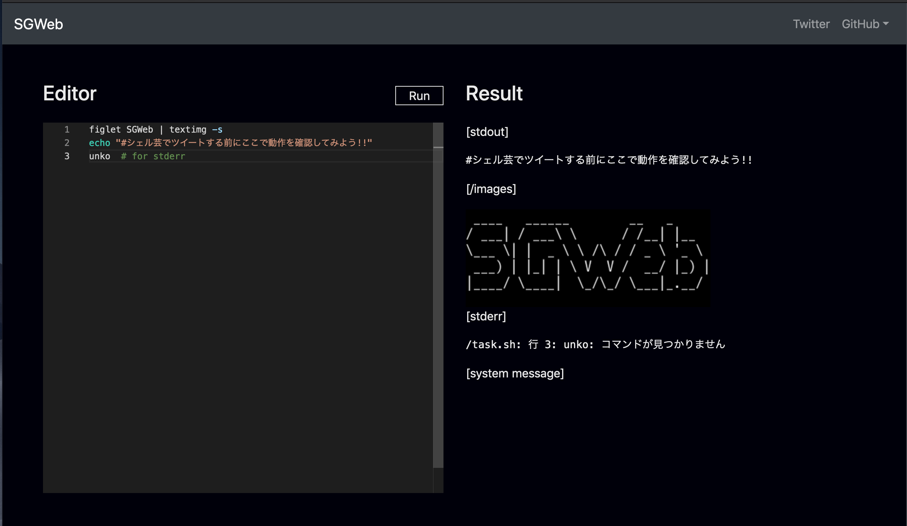

# SGWeb



@theoldmoon0602氏の[ShellgeiBot](https://github.com/theoldmoon0602/ShellgeiBot)のWEBアプリ版  
人気を博しているTwitterアカウント: [シェル芸bot](https://twitter.com/minyoruminyon)に投稿する前に、まずはこっちでリハーサルしようという趣旨。

## 依存関係

- docker  
- docker-compose  

## ビルド

```sh
docker-compose build
```

## 起動

```sh
docker-compose up
```

[localhost:80](http://localhost:80)にアクセスすることでSGWebを利用できます


## 使用しているもの

[ShellgeiBot-Image](https://github.com/theoldmoon0602/ShellgeiBot-Image): Apache-2.0 license
